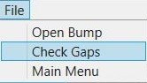

# GapDetection
An Application to Detect Gaps in an Excel Postion Rotation System.

## About The Project
A position rotation system assigns positions to an employee's shift, to perform that position's tasks. When creating this for multiple employees, errors can occur. Like when a certain position only needs one employee to have that position at any given moment in time. Sometimes multiple employees may be assigned that position at the same time, when only one employee should have that position at that given time. Or the certain position will not be assigned at all. 

Therefore, the need to check for gaps or duplications arises. To do this manually works but becomes harder when dealing with enormous amounts of employees. This application checks to see if there are any gaps for given positions that need to be assigned throughout the shifts. It also checks to see if any position has been assigned multiple times at a given time that should only be assigned once.

The application allows you to create an area and create that area's positions and visually displays the gaps or duplications.

## Project Description

The main menu has a dropdown and two buttons. The dropdown allows you to choose a venue. The button on the left goes to the gap display window. The button on the right goes the settings window. 

The settings window allows you to create a venue or select one. One the left side of the window is where you add or delete a selected venue’s positions. You can also arrange the order of the positions as how they will appear in the gap detection display. Once you are done creating a venue/position, you can save the progress.

From the main, select a venue and click the gap button. This will take you to the gap window. The Gap window consists of a top and bottom time bar, two position legends and the center where the gap information will be displayed.

     

This is the menu tab. It has three options. The first is, Open File. This will allow you to open specific excel files to use with the application. The second is Check For Gaps. This will read the information on the excel file and translate it to the gap display window. The third is Main Menu. This will take you back to the main menu.

## What I Learned
This application uses several design patterns and frameworks. It mostly focuses on ASP.NET WEB/API. Although it does use a little MVC, to talk to the database with api/controllers. The UI is setup wiith MVVM with the help of an IoC container. Using Caliburn.Micro, the container itializes dependency injection to decrease the dependencies higher level classes have to lower level classes, mostly through constructor injection, with Interface parameters.

This project has helped me to learn how to properly setup an application for testability and scalability. How to separate my UI code from the logic, database and libraries. I've learned different design patterns and tools and how to implement them. This project is still ongoing and I hope to continue my knowledge and progress.  
